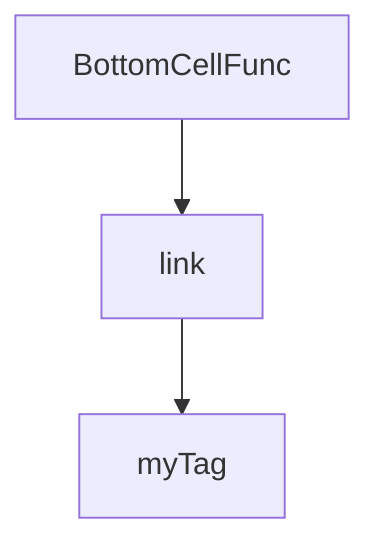
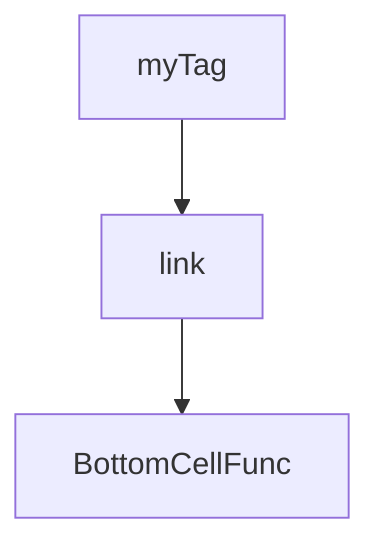

import DemoWrapper from "@site/src/components/DemoWrapper";
import CodeBlock from "@site/src/theme/CodeBlock";
import Mermaid from "@theme/Mermaid";
import {
  ExtendsFormBase,
  ExtendsFormItem,
  ExtendsTableBase,
  ExtendsActionsBase,
} from "examples";
import { default as extendsFormBaseRaw } from "!raw-loader!examples/demo/extends/extendsFormBase.tsx";
import { default as extendsFormItemRaw } from "!raw-loader!examples/demo/extends/extendsFormItem.tsx";
import { default as extendsTableBasaeRaw } from "!raw-loader!examples/demo/extends/extendsTableBase.tsx";
import { default as extendsActionsBaseRaw } from "!raw-loader!examples/demo/extends/extendsActionsBase.tsx";

# 扩展自定义组件

## 扩展 XphForm 表单项

### 扩展表单项

如果当前 `XphForm` 组件的所有表单项都满足不了你，`xph-crud` 还提供`XphExtendCompPropsProvider`来扩展表单项，你只需要使用`XphExtendCompPropsProvider`来包裹你的应用，并且为其提供一个表单项的映射对象即可，详细请看下方代码块：

<CodeBlock language={"tsx"}>{extendsFormBaseRaw}</CodeBlock>

<pre>
  <DemoWrapper>
    <ExtendsFormBase />
  </DemoWrapper>
</pre>

### 扩展表单项的规范

<CodeBlock language={"tsx"}>{extendsFormItemRaw}</CodeBlock>

<pre>
  <DemoWrapper>
    <ExtendsFormItem />
  </DemoWrapper>
</pre>

:::tip

如果你使用的是 TypeSctipt，扩展表单项后，因为`IXphFormProps`类型中不包含你扩展表单项的类型，所以需要重新定义一下类型来使用，详细可看下方 ts 类型调整。

:::

## 扩展 XphTable 单元格映射内容

### 扩展单元格映射内容

同理，`XphTable`中的映射内容也是可以自定义的，也是通过给`XphExtendCompPropsProvider`添加单元格映射对象即可的方式。

<CodeBlock language={"tsx"}>{extendsTableBasaeRaw}</CodeBlock>

<pre>
  <DemoWrapper>
    <ExtendsTableBase />
  </DemoWrapper>
</pre>

### 扩展单元格映射内容的规范

#### 组件处理机制

内部的 CellFunc 组件会遍历 cellFunc 这个数组，逐步将最底层的 BottomCellFunc 组件处理成最终渲染在页面的组件，处理顺序如下：

<div style={{ textAlign: "center" }}>



</div>

#### 组件渲染机制

由于是按顺序处理完再渲染，所以 cellFunc 数组映射的组件渲染是有顺序之分的，渲染顺序如下：

<div style={{ textAlign: "center" }}>



</div>

#### 扩展规范

```tsx
import React from "react";
import { IXphMainProps } from "xph-crud";

interface IMyTagProps {
  children?: string;
  borderColor?: string;
}

/**
 * @params Comp 上一次处理后的组件
 * @params curCellFuncProps 当前项相关属性
 * @params mainProps 透传给最底层组件的属性
 */
const MyTag = (
  Comp: React.JSXElementConstructor<any>,
  curCellFuncProps: { curComponentProps: IMyTagProps },
  mainProps: IXphMainProps
) => {
  /**
   * curCellFuncProps是包含当前自定义项componentProps的参数，可以从中取到外部透传进来的属性进行业务代码编写
   */
  const { curComponentProps } = curCellFuncProps;

  const { borderColor = "blue", children = "" } = curComponentProps!;
  return (
    <div
      style={{
        display: "flex",
        alignItems: "center",
        flexWrap: "wrap",
        border: `1px solid ${borderColor}`,
      }}
    >
      {/** 
      1、Comp是保持渲染链的桥梁，只有当Comp组件被渲染时，才能保持渲染链不被中断，所以在写你的自定义组件时，这个Comp属性是必须使用在组件上的(当然特殊情况除外，除非你只想渲染这个自定义的组件) 

      2、mainProps是渲染链中渲染后方传递给最底层BottomCellFunc组件的属性，目的是为了使当前自定义组件能够影响到BottomCellFunc组件的事件和样式，所以mainProps是保持渲染链中事件和样式能够正确执行属性，它必须在扩展组件内部解构传递给Comp组件（注意：如果当前扩展的组件内部需要影响到底层BottomCellFunc，必须要保证其他映射组件的正常调用，XphTable内部的link组件就是一个很好的例子）
      */}
      <Comp {...mainProps} />
      {children}
    </div>
  );
};
```

:::warning

总的来说规范有三点：

1. 必须保证扩展组件中的首个参数 Comp 被渲染来保持渲染链
2. 必须保证扩展组件中的第三个参数 mainProps 解构传递给 Comp 组件
3. 自定义组件在需要传递自己的 mainProps 给底层的 BottomCellFunc 组件时，必须保证其他映射组件的正常调用

:::

:::tip

如果你使用的是 TypeSctipt，扩展单元格映射内容后，因为`TXphTableProps`类型中不包含你扩展的类型，所以需要重新定义一下类型来使用，详细可看下方 ts 类型调整。

:::

## 扩展 XphActions 操作组映射内容

### 扩展操作组映射内容

同理，`XphActions`中的映射内容也是可以自定义的，也是通过给`XphExtendCompPropsProvider`添加操作组映射对象即可的方式。

<CodeBlock language={"tsx"}>{extendsActionsBaseRaw}</CodeBlock>

<pre>
  <DemoWrapper>
    <ExtendsActionsBase />
  </DemoWrapper>
</pre>

:::tip

如果你使用的是 TypeSctipt，扩展操作组映射内容后，因为`IXphActionsProps`类型中不包含你扩展的类型，所以需要重新定义一下类型来使用，详细可看下方 ts 类型调整。

:::

## ts 类型调整

待书写。。。
